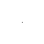

# AI Neural Cellular Automata
### Differentiable Morphogenesis

Based on paper : [Distill Growing CA](https://distill.pub/2020/growing-ca/)

---

<table>
  <tr>
    <td></td>
    <td style="width:1px; background-color:#000;"></td>
    <td></td>
  </tr>
</table>

Coded a neural cellular automata that learns on its own the rules to grow to a certain structure.
The neural network acts only on the cell level, taking as input only the state of its neighbors.

To run, install requirements.txt. Then run:

```python
python src/gui.py
```

You can press Esc to run / pause the simulation. Clicking on cells will disrupt the pattern, forcing it to regenerate.

You can train a model using main.py.
